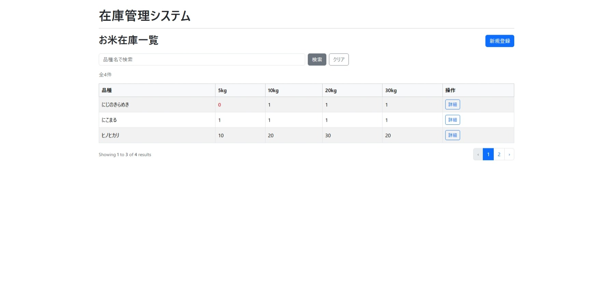
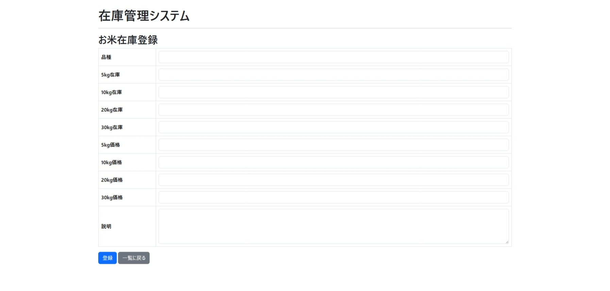
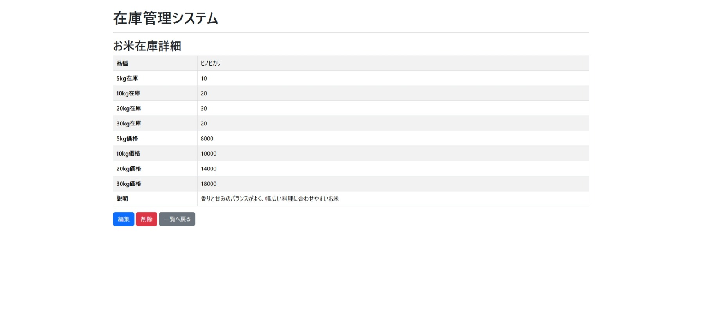
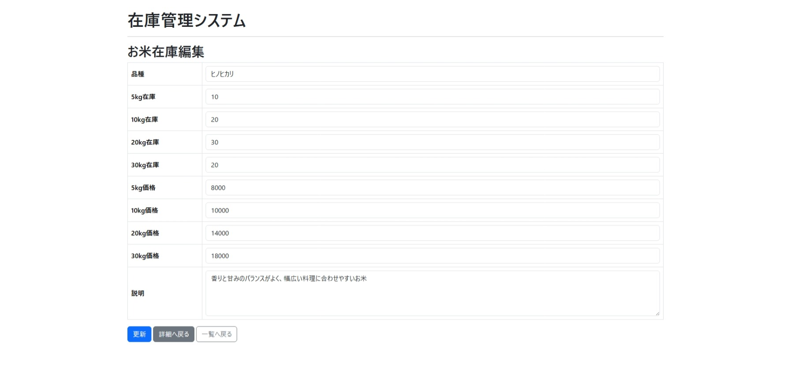

# お米在庫管理システム

## 概要

Laravelを使用して作成したお米在庫管理システムです。

品種ごとの在庫数や価格を管理できるCRUDアプリケーションとして作成しました。

## 画面イメージ

### 商品一覧

### 商品登録

### 商品詳細

### 商品編集

## 主な機能

* 商品一覧表示
* 商品登録
* 商品詳細表示
* 商品編集
* 商品削除
* 品種検索
* ページネーション
* バリデーション
* フラッシュメッセージ
* 削除確認ダイアログ
* 在庫切れ商品の強調表示

## 使用技術

| 項目        | 内容     |
| --------- | ------ |
| PHP       | 8.2    |
| Laravel   | 12     |
| Bootstrap | 5      |
| Database  | SQLite |

## 設計

本システムは実装前に以下の設計を行いました。

- 画面一覧
- 画面設計
- 項目定義
- DB設計

設計書は docs フォルダに格納しています。

### 画面一覧

- 商品一覧
- 商品登録
- 商品詳細
- 商品編集

## 工夫した点

* FormRequestを利用してバリデーションを実装
* Bladeレイアウトを利用して共通部分を共通化
* 検索機能とページネーションを組み合わせて実装
* 在庫0の商品を赤文字で表示

## 今後の改善案

* ソート機能
* CSV出力機能
* 在庫アラート機能
