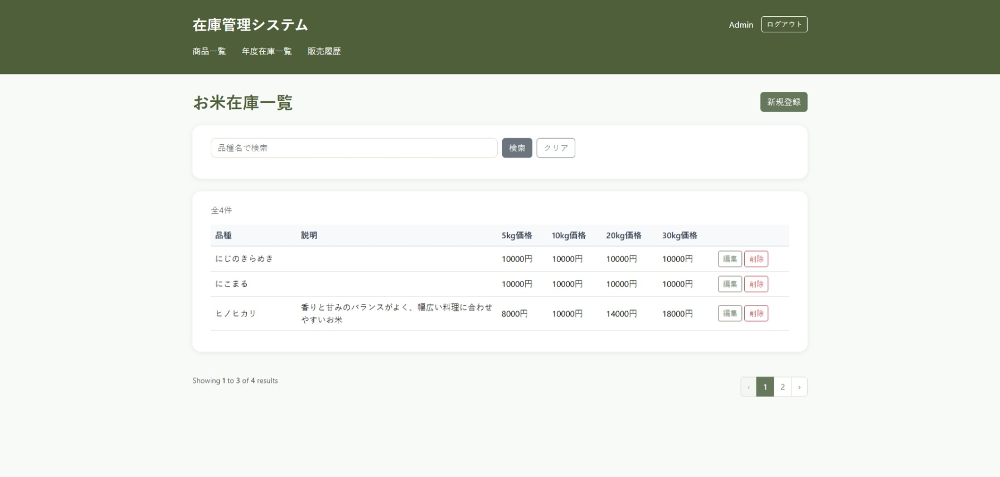
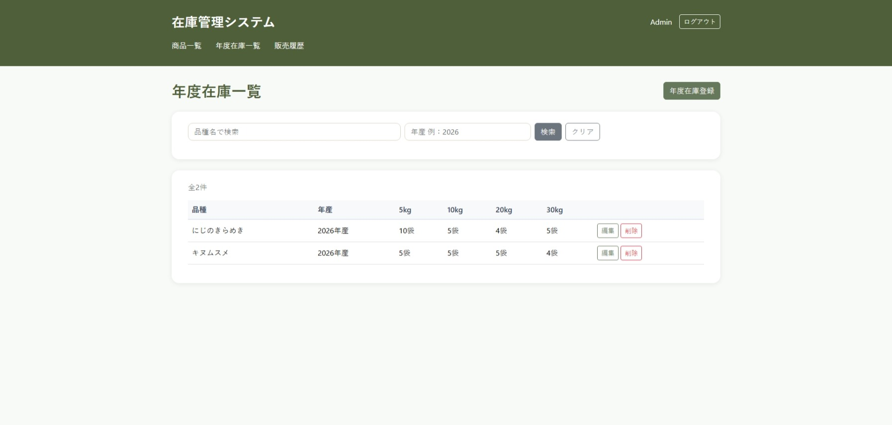
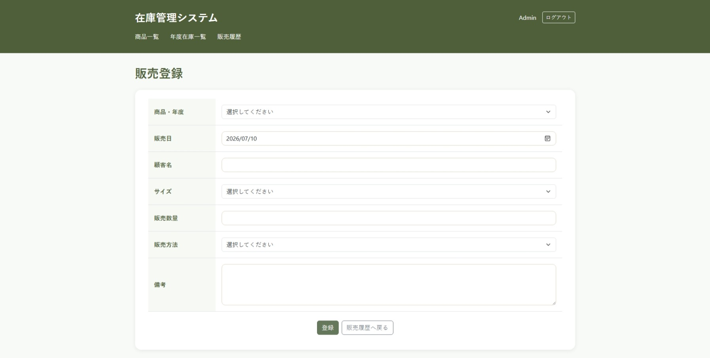
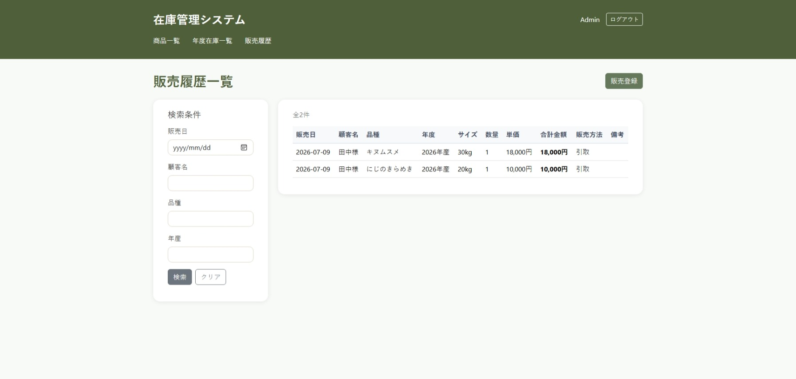

# お米在庫管理システム

## 概要

Laravelを使用して制作した、お米の在庫・販売管理システムです。
商品情報や年度別の在庫を管理し、販売登録時には在庫を自動で減算します。販売履歴の検索や売上集計にも対応しており、実際の業務を想定して開発しました。

## 画面イメージ

### 商品一覧



### 年度在庫一覧



### 販売履歴



### 販売登録




## 主な機能

■認証
・ログイン・ログアウト

■商品管理
・商品登録
・商品編集
・商品削除

■年度在庫管理
・年度別在庫登録
・在庫編集

■販売管理
・販売登録
・販売履歴表示
・販売履歴検索

■在庫管理
・販売登録時の在庫自動減算

■集計
・検索結果に応じた売上合計金額表示

## 認証について

Laravel Breezeを利用してログイン認証を実装しています。
本システムは管理者が利用することを想定しており、
ログイン後に商品・在庫・販売情報を管理できます。

### テストアカウント

```text
メールアドレス：admin@rice-system.test
パスワード：password123
```

## 使用技術

| 項目        | 内容     |
| --------- | ------ |
| PHP       | 8.2    |
| Laravel   | 12     |
| Bootstrap | 5      |
| Database  | MySQL  |

## 設計

本システムは実装前に以下の設計を行いました。

- 画面一覧
- 画面設計
- 項目定義
- DB設計

設計書は docs フォルダに格納しています。

### 画面一覧

- 商品一覧
- 商品登録
- 商品編集
- 年度在庫一覧
- 年度在庫登録
- 年度在庫編集
- 販売履歴
- 販売登録

## 工夫した点

* FormRequestを利用してバリデーションを実装
* Bladeレイアウトを利用して共通部分を共通化
* 検索機能とページネーションを組み合わせて実装
* 在庫0の商品を赤文字で表示
* Eloquentリレーションを利用して商品・在庫・販売情報を関連付け
* 販売登録時に在庫を自動更新し、データ整合性を維持
* 検索条件に応じた売上合計金額を表示
* Bootstrapを利用した見やすいUI

## 今後の改善案

* CSV出力機能
* 在庫アラート機能
* 月別・品種別売上集計
* ユーザー権限管理
* ダッシュボード
